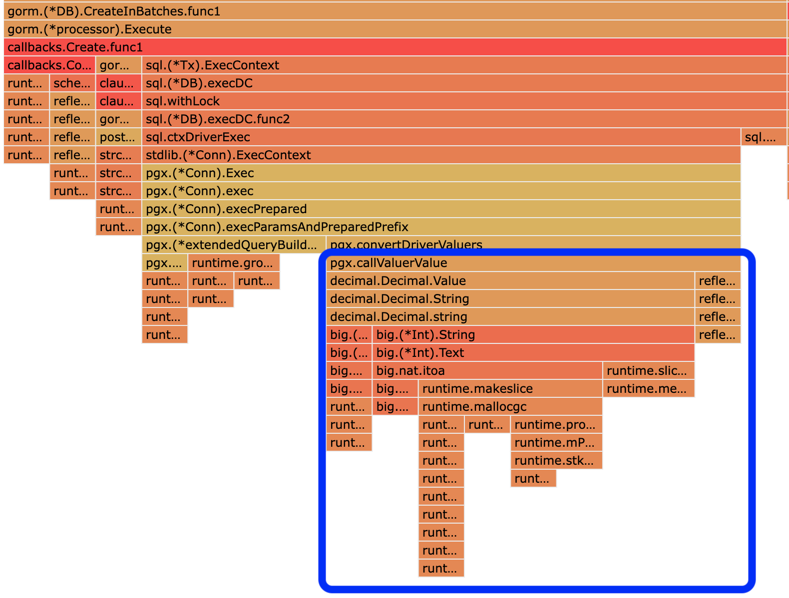

# alpacadecimal
Similar and compatible with decimal.Decimal, but optimized for Alpaca's data sets.

### Goal
- optimize for Alpaca data sets.
- compatible with `decimal.Decimal` so that it could be a drop-in replacement for current `decimal.Decimal` usage.

### Key Ideas

The original `decimal.Decimal` package has bottleneck on `big.Int` operations, e.g. sql serialization / deserialization, addition, multiplication etc. These operations took fair amount cpu and memory during
our profiling / monitoring.



The optimization this library is to represent most decimal numbers with `int64` instead of `big.Int`. To 
keep this library to be compatible with original `decimal.Decimal` package, we use original as a fallback
solution when `int64` is not enough (e.g. number is too big / small, too many precisions).

The core data struct is like following:

```golang
type Decimal struct {
	// represent decimal with 12 precision, 1.23 will have `fixed = 1_230_000_000_000`
	// max support decimal is 9_223_372.000_000_000_000
	// min support decimal is -9_223_372.000_000_000_000
	fixed int64

	// fallback to original decimal.Decimal if necessary
	fallback *decimal.Decimal
}
```

We pick 12 precisions because it could cover 99% of Alpaca common cases as indicated in design doc.


### Compatibility

In general, `alpacadecimal.Decimal` is fully compatible with `decimal.Decimal` package, as `decimal.Decimal` is used as 
a fallback solution for overflow cases.

There are a few special cases / APIs that `alpacadecimal.Decimal` behaves different from `decimal.Decimal` (behaviour is still
correct / valid, just different). Affected APIs:

- `Decimal.Exponent()`
- `Decimal.Coefficient()`
- `Decimal.CoefficientInt64()` 
- `Decimal.NumDigits()`

For optimized case, `alpacadecimal.Decimal` always assume that exponent is 12, which results in a valid but different decimal representation. For example,

```golang
x := alpacadecimal.NewFromInt(123)
require.Equal(t, int32(-12), x.Exponent())
require.Equal(t, "123000000000000", x.Coefficient().String())
require.Equal(t, int64(123000000000000), x.CoefficientInt64())
require.Equal(t, 15, x.NumDigits())

y := decimal.NewFromInt(123)
require.Equal(t, int32(0), y.Exponent())
require.Equal(t, "123", y.Coefficient().String())
require.Equal(t, int64(123), y.CoefficientInt64())
require.Equal(t, 3, y.NumDigits())
```

### Related Issues
- `big.NewInt` optimization from [here](https://go-review.googlesource.com/c/go/+/411254) might help to speed up some `big.Int` related operations.
- `big.Int.String` slowness is tracked by [this issue](https://github.com/golang/go/issues/20906). The approach we reduce this slowness is to use int64 to represent the number if possible to avoid `big.Int` operations.

### Benchmark

Generally, for general case (99%), the speedup varies from 5x to 100x.

```
$ make bench
go test -bench=. --cpuprofile profile.out --memprofile memprofile.out
goos: darwin
goarch: amd64
pkg: github.com/alpacahq/alpacadecimal
cpu: Intel(R) Core(TM) i9-9880H CPU @ 2.30GHz
BenchmarkValue/alpacadecimal.Decimal_Cached_Case-16             314870084                3.498 ns/op
BenchmarkValue/alpacadecimal.Decimal_Optimized_Case-16          15383466                70.27 ns/op
BenchmarkValue/alpacadecimal.Decimal_Fallback_Case-16            5603755               209.2 ns/op
BenchmarkValue/decimal.Decimal-16                                6167956               184.5 ns/op
BenchmarkValue/eric.Decimal-16                                   7021383               162.2 ns/op
BenchmarkAdd/alpacadecimal.Decimal-16                           556380649                2.132 ns/op
BenchmarkAdd/decimal.Decimal-16                                 15557970                68.31 ns/op
BenchmarkAdd/eric.Decimal-16                                    27423730                40.34 ns/op
BenchmarkSub/alpacadecimal.Decimal-16                           268269063                4.410 ns/op
BenchmarkSub/decimal.Decimal-16                                 17239782                59.17 ns/op
BenchmarkSub/eric.Decimal-16                                    24690660                40.81 ns/op
BenchmarkScan/alpacadecimal.Decimal-16                          87226915                13.46 ns/op
BenchmarkScan/decimal.Decimal-16                                 6075110               191.1 ns/op
BenchmarkScan/eric.Decimal-16                                    6422792               174.4 ns/op
BenchmarkMul/alpacadecimal.Decimal-16                           168732728                7.176 ns/op
BenchmarkMul/decimal.Decimal-16                                 16051546                66.57 ns/op
BenchmarkMul/eric.Decimal-16                                    39927952                28.20 ns/op
BenchmarkDiv/alpacadecimal.Decimal-16                           152054401                7.772 ns/op
BenchmarkDiv/decimal.Decimal-16                                  4098888               281.7 ns/op
BenchmarkDiv/eric.Decimal-16                                    34245668                31.42 ns/op
BenchmarkString/alpacadecimal.Decimal-16                        385985688                3.032 ns/op
BenchmarkString/decimal.Decimal-16                               7750777               150.9 ns/op
BenchmarkString/eric.Decimal-16                                  6694531               167.0 ns/op
BenchmarkRound/alpacadecimal.Decimal-16                         88814521                11.92 ns/op
BenchmarkRound/decimal.Decimal-16                                4333029               255.7 ns/op
BenchmarkRound/eric.Decimal-16                                  55717095                21.34 ns/op
PASS
ok      github.com/alpacahq/alpacadecimal       37.671s
```
